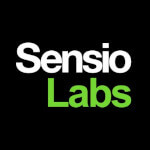

# Hey 👋

## 👾 About us

SensioLabs was originally founded as a web agency by [Fabien Potencier](https://github.com/fabpot) and Gregory Pascal.

Back in 2005, **SensioLabs created the Open-Source PHP framework [Symfony](https://github.com/symfony/symfony)**, which became a global reference in web development and PHP.

Even though Symfony is an Open-Source project, **SensioLabs continues to strongly support the development of the framework and to help the organizations that use it**. As the creator of Symfony, SensioLabs is the premier service provider for Symfony, offering a comprehensive range of consulting, expertise, and development services, and operating the official Symfony training center.

## 💻 What we do

**[SensioLabs](https://sensiolabs.com/) boasts the largest number of Symfony certified developers in the world**, and our technical team strives to make developers' lives easier in every project we work on. SensioLabs also stands out with a quality-focused approach, advocating for tools, methodologies and services that enable developers to work in the best possible way.

Our technical team is very active, **contributing to the core of Symfony** and documentation, **participating in the community**, writing articles, speaking at technical conferences, promoting open source, etc. Our mission is also to **educate and evangelize** web developers to continue the extraordinary adventure that is Symfony.

Here are some resources you can find to follow us 👇

## 🔥 Our top contributions to Open Source

* [Symfony](https://github.com/symfony/symfony): a set of reusable PHP components and a framework to build web applications, APIs, microservices and web services.
* [Symfony UX](https://github.com/symfony/ux): PHP & JavaScript packages to solve your everyday frontend problems.
* [GotenbergBundle](https://github.com/sensiolabs/GotenbergBundle): allows for the conversion of HTML, Markdown, or Office documents into PDFs using the [Gotenberg](https://gotenberg.dev/) API.
* [StorybookBundle](https://github.com/sensiolabs/StorybookBundle): an integration for Symfony to build and test UI components making them easier to document and maintain.
* [AssetMapperTypeScriptBundle](https://github.com/sensiolabs/AssetMapperTypeScriptBundle): compile TypeScript and use it with the AssetMapper Component in Symfony.
* [MinifyBundle](https://github.com/sensiolabs/minify-bundle): integrates [Minify](https://github.com/tdewolff/minify) into Symfony Asset Mapper.

We’re thrilled to support versions of Symfony, as well as components of the framework, through the [Backers](https://symfony.com/backers) program.

We’re also proud to sponsor the [Symfony conferences](https://live.symfony.com/) every year. They're a fantastic way to build community and share knowledge in a fun atmosphere.

## 📲 Follow us

* Twitter / X: [corporate account](https://x.com/sensiolabs) | [tech team account](https://x.com/SensioLabsTech)
* [Bluesky](https://bsky.app/profile/sensiolabs.com)
* [Mastodon](https://mastodon.social/@SensioLabsOfficial)
* [LinkedIn](https://www.linkedin.com/company/sensiolabs/)
* [Instagram](https://www.instagram.com/sensiolabs/)
* [Youtube](https://www.youtube.com/@sensiolabs9618)

Our team is **a regular contributor of articles to Medium and Dev.to**. Here are the links to find them:
* [The SensioLabs Tech Blog](https://medium.com/the-sensiolabs-tech-blog) on Medium
* [The SensioLabs page](https://dev.to/sensiolabs) on Dev.to

Feel free to encourage our writers and follow them!

You can also visit [A Week of Symfony](https://symfony.com/blog/category/a-week-of-symfony), the official weekly digest of everything happening in Symfony development, and [our blog](https://sensiolabs.com/blog), where we often post tech-related articles.

## 👀 Learn more

* Visit our website https://sensiolabs.com/
* Join our team https://sensiolabs.com/company/careers
* Browse our training programs https://training.sensiolabs.com/en/
* Get ready for the Symfony Certification https://certification.symfony.com/exams/get-ready.html
* Ask for an expert https://sensiolabs.com/experts
* Discover our white papers https://sensiolabs.com/white-papers

📨 **Contact us** [contact@sensiolabs.com](mailto:contact@sensiolabs.com) or [+33 1 86 65 72 00](tel:+33186657200)
